Dans ce TP, nous implémentons un prouveur de théorèmes pour la logique minimale en déduction naturelle.

## Représentation et utilitaires

Nous utiliserons les types suivants :

```ocaml
type formule =
  | Var of string
  | Top
  | Bot
  | And of formule * formule
  | Or of formule * formule
  | Implies of formule * formule
  | Not of formule;;

type sequent = {
  gamma : formule list;
  phi : formule;
};;
```

Pour entrer une formule, on pourra utiliser le parser fourni :

```ocaml
#use "parser.ml";; (* après la définition des types, et en modifiant le chemin si besoin *)

parse_sequent "|- A -> A | B"
- : sequent = {gamma = []; phi = Implies (Var "A", Or (Var "A", Var "B"))}
parse_sequent "A, (A -> B) |- B"
- : sequent = {gamma = [Var "A"; Implies (Var "A", Var "B")]; phi = Var "B"}
parse_sequent "|- (A & !A) -> F"
- : sequent = {gamma = []; phi = Implies (And (Var "A", Not (Var "A")), Bot)}
```

2. Écrire une fonction `string_of_formule : formule -> string` avec la convention d'affichage `&`, `|`, `!`. On rappelle que `^` sert à concaténer des chaînes en OCaml.
3. Écrire une fonction `string_of_sequent : sequent -> string`.

```ocaml
string_of_formule (And (Var "A", Not (Var "B")));; (* "(A & (! B))" *)
string_of_formule (Implies (Var "A", Or (Var "A", Var "B")));; (* "(A -> (A | B))" *)

string_of_sequent { gamma = [Var "A"; Implies (Var "A", Var "B")]; phi = Var "B" };; (* "A, (A -> B) |- B" *)
```

## Règles et arbres de preuve

On utilise les types suivants :

```ocaml
type regle =
  | Axiom
  | ImpliesIntro
  | ImpliesElim of formule (* A *)
  | AndIntro
  | AndElim1 of formule (* B *)
  | AndElim2 of formule (* A *)
  | OrIntro1
  | OrIntro2
  | OrElim of formule * formule (* A, B *)
  | NotElim of formule (* A *)
  | NotIntro

type arbre_preuve =
  | Noeud of regle * sequent * arbre_preuve list
```

<div
  style={{
    display: "grid",
    gridTemplateColumns: "repeat(auto-fit, minmax(150px, 1fr))",
    gap: "10px",
    alignItems: "center",
  }}
>
  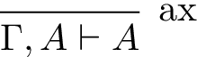
  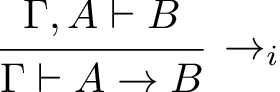
  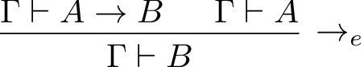
  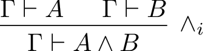
  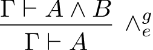
  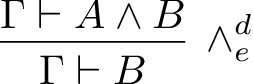
  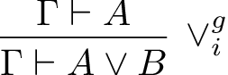
  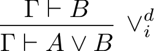
  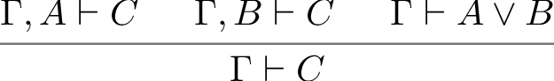
  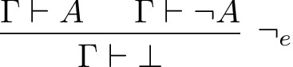
  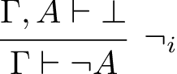
</div>

Les arguments des constructeurs correspondent aux formules utilisées dans les règles.

4. Écrire `appliquer_regle : regle -> sequent -> sequent list option` vérifiant si la règle est applicable au séquent donné, et si oui, renvoyant les prémisses à prouver. Si la règle n'est pas applicable, renvoyer `None`.

```ocaml
# appliquer_regle Axiom { gamma = [Var "A"]; phi = Var "A" };; (* Some [] *)
# appliquer_regle Axiom { gamma = [Var "A"]; phi = Var "B" };; (* None *)
# appliquer_regle AndIntro { gamma = [Var "A"]; phi = And (Var "A", Var "B") };;
- : sequent list option =
Some
 [{gamma = [Var "A"]; phi = Var "A"};
    {gamma = [Var "A"]; phi = Var "B"}]

# appliquer_regle (NotElim (Or (Var "A", Var "B")))
        { gamma = [Var "B"; Not (Var "A")]; phi = Bot };;
- : sequent list option =
Some
 [{gamma = [Var "B"; Not (Var "A")]; phi = Not (Or (Var "A", Var "B"))};
    {gamma = [Var "B"; Not (Var "A")]; phi = Or (Var "A", Var "B")}]

# appliquer_regle (OrElim (Var "A", Var "B")) { gamma = []; phi = Var "C" };;
- : sequent list option =
Some
 [{gamma = []; phi = Or (Var "A", Var "B")};
    {gamma = []; phi = Implies (Var "A", Var "C")};
    {gamma = []; phi = Implies (Var "B", Var "C")}]
```

## Recherche de preuve

5. Écrire `sous_formules_f : formule -> formule list` qui renvoie la liste de toutes les sous-formules d'une formule donnée (y compris la formule elle-même).

```ocaml
# sous_formules_f (And (Var "A", Or (Var "B", Var "C")));;
- : formule list =
[And (Var "A", Or (Var "B", Var "C")); Var "A"; Or (Var "B", Var "C");
 Var "B"; Var "C"]
```

6. Écrire `sous_formules_gamma : ensemble_formules -> formule list` qui renvoie la liste de toutes les sous-formules présentes dans le contexte `gamma`.

```ocaml
# sous_formules_gamma [And (Var "A", Var "B"); Or (Var "C", Var "D")];;
- : formule list =
[And (Var "A", Var "B"); Var "A"; Var "B"; Or (Var "C", Var "D"); Var "C";
 Var "D"]
```

7. Écrire `regles_possibles : sequent -> regle list` qui, étant donné un séquent, renvoie la liste des règles de déduction naturelle applicables pour prouver ce séquent. On peut utiliser les sous-formules du contexte pour limiter les règles proposées.

```ocaml
# regles_possibles { gamma = [And (Var "A", Var "B")]; phi = Var "A" };; (* Axiom, AndElim1(And(A,B)), AndElim2(And(A,B)) *);;
- : regle list =
[Axiom; AndElim1 (And (Var "A", Var "B")); AndElim2 (And (Var "A", Var "B"));
 ImpliesElim (And (Var "A", Var "B")); NotElim (And (Var "A", Var "B"));
 AndElim1 (Var "A"); AndElim2 (Var "A"); ImpliesElim (Var "A");
 NotElim (Var "A"); AndElim1 (Var "B"); AndElim2 (Var "B");
 ImpliesElim (Var "B"); NotElim (Var "B")]
```

8. Écrire `prouver : int -> sequent -> arbre_preuve option` qui, étant donné une profondeur maximale `depth` et un séquent, tente de construire un arbre de preuve pour ce séquent en utilisant les règles possibles. Si une preuve est trouvée, renvoyer `Some arbre_preuve`, sinon `None`.
   On utilisera la fonction suivante pour afficher l'arbre de preuve :

```ocaml
let rec afficher_arbre_preuve depth (Noeud (r, s, premises)) =
  let indent = String.make (depth * 2) ' ' in
  Printf.printf "%s[%s] %s\n" indent (string_of_regle r) (string_of_sequent s);
  List.iter (afficher_arbre_preuve (depth + 1)) premises;;
```

Indications :

- Cas de base : si `depth <= 0`, renvoyer `None`.
- Sinon, essayer les règles retournées par `regles_possibles` une par une.
- Pour une règle applicable, prouver toutes les prémisses avec profondeur `depth - 1`.
- Si une prémisse échoue, revenir en arrière (backtracking) et tester la règle suivante.

```ocaml
# prouver 2 (parse "(A & B) |- A") |> Option.get (afficher_arbre_preuve 1);;
  [AndElim1(B)] (A & B) |- A
    [Axiom] (A & B) |- (A & B)
# prouver 4 (parse "|- (A & B) -> (B & A)") |> Option.get (afficher_arbre_preuve 1);;
  [ImpliesIntro]  |- ((A & B) -> (B & A))
    [AndIntro] (A & B) |- (B & A)
      [AndElim2(A)] (A & B) |- B
        [Axiom] (A & B) |- (A & B)
      [AndElim1(B)] (A & B) |- A
        [Axiom] (A & B) |- (A & B)
```

Essayer avec d'autres séquents plus difficiles.

9. Écrire `prouver_min : int -> sequent -> arbre_preuve option` qui, étant donné une profondeur maximale `max_depth` et un séquent, tente de trouver une preuve de ce séquent avec la plus petite profondeur possible (inférieure ou égale à `max_depth`).

```ocaml
prouver_min 8 (parse "|- (A & (B | C)) -> ((A & B) | (A & C))") |> Option.iter (afficher_arbre_preuve 1);;
```
